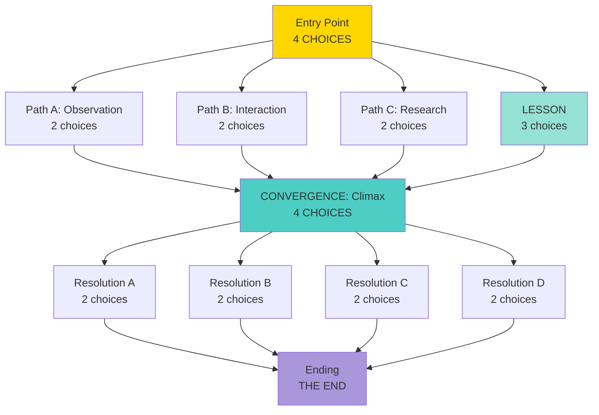

# Story Management Toolkit

A comprehensive framework for planning, validating, and visualizing complex narrative structures in the Young Lady's Primer.

## Purpose

As story content grows in complexity, we need better tools to:
- Visualize branching and convergence patterns
- Catch structural errors before they reach production
- Navigate story graphs during authoring
- Maintain narrative coherence across multiple paths

This toolkit provides three complementary systems to support confluence narrative design at scale.

---

## Part 1: Narrative Structure Patterns

### What is Confluence Narrative?

The Primer uses a **confluence narrative** structure (also called "braided narrative" or "diamond structure") that balances meaningful choice with narrative coherence.

Think of it as:
- **Tree trunk**: Main storyline with essential beats everyone experiences
- **Tributaries**: Optional paths that split (choices) and rejoin (convergence points)
- **River delta**: Multiple streams that feel different but merge for emotional climax

### Why Not Pure Branching?

Pure branching creates exponential complexity:
- 4 choices → 4 paths
- Each with 4 choices → 16 paths
- Continue for 5 levels → 1,024 unique endings

This is unsustainable for hand-crafted narrative and leads to:
- Shallow, interchangeable paths (all feel the same)
- Impossible maintenance burden
- Reader choice paralysis

### The Confluence Solution

Instead, paths **split and rejoin**:
- Readers feel agency (choices matter in the moment)
- Paths converge at key story beats (ensures narrative quality)
- Manageable content creation (18 nodes, not 1,024)
- Emotional coherence (everyone experiences the climax)

### Dragon Story Example

The dragon story demonstrates confluence structure:

**Investigation Phase** (3 tributaries):
- `dragon_pattern` → Observation path (study from distance)
- `dragon_approach` → Interaction path (brave meeting)
- `dragon_engineers` → Research path (consult experts)

**Convergence Point**:
- All paths → `elara_revealed` (the truth unveiled)
- Everyone experiences this emotional climax regardless of approach

**Philosophical Choice** (4 tributaries):
- `show_compassion` → Lead with heart
- `unite_forces` → Integrate science and magic
- `power_story` → Transform through narrative
- `seek_understanding` → Wisdom through patience

**Resolution Convergence**:
- All paths → `find_peace` (Elara creates Academy of Transformations)

**Result**: Readers feel like they took meaningfully different paths, but the story maintains coherent emotional arc and thematic resolution.

### When to Use Each Pattern

**Confluence (Braided) Structure:**
- Long-form narratives (15+ nodes)
- Character development arcs
- Educational content with multiple learning approaches
- Stories with clear thematic resolution

**Pure Branching:**
- Short decision trees (5-8 nodes)
- Puzzles with right/wrong answers
- Tutorial sequences
- Quick interaction moments

**Linear Progression:**
- Lesson content
- Exposition and world-building
- Breather pages between choices
- Resolution sequences

---

## Part 2: Story Management Framework

The toolkit consists of three complementary systems:

### System Overview

```
┌─────────────────────────────────────────────────────────┐
│                 Story Authoring Workflow                │
├─────────────────────────────────────────────────────────┤
│                                                         │
│  1. Plan structure using Flow Visualizer               │
│     ↓                                                   │
│  2. Write content in TypeScript files                  │
│     ↓                                                   │
│  3. Validate with Validation Script                    │
│     ↓                                                   │
│  4. Review structure in Flow Visualizer                │
│     ↓                                                   │
│  5. Generate Table of Contents                         │
│                                                         │
└─────────────────────────────────────────────────────────┘
```

### How They Work Together

**Validation Script** catches errors:
- Broken action references (`action: "typo"` → no matching node)
- Orphaned nodes (nothing points to them)
- Dead ends (no choices, not marked as ending)
- Circular references (if unintended)

**Flow Visualizer** shows structure:
- Interactive graph navigation
- Convergence point visualization
- Path length and complexity metrics
- Progress tracking for readers

**Table of Contents** provides navigation:
- Hierarchical story organization
- Main trunk vs side branch indication
- Reader progress tracking
- Direct navigation during authoring

---

## Part 3: Implementation Projects

Each project is designed to be implemented independently in a fresh Claude session.

---

### Project 1: Story Graph Validation Script

**Problem Statement**

Currently, broken story references are only caught at runtime when a reader clicks a choice. We need compile-time validation to catch:
- Typos in action strings
- Orphaned content nodes
- Dead-end pages (no choices, not marked as ending)
- Unreachable content

**Technical Requirements**

- **Language**: TypeScript
- **Integration**: npm script (`npm run validate-content`)
- **Input**: Existing content registry from `src/content/index.ts`
- **Output**: Human-readable error report with file locations

**Core Validation Checks**

1. **Reference Validation**
   - Every `choice.action` points to a real node in `allContent`
   - Report: line number, file, invalid reference

2. **Orphan Detection**
   - Find nodes that nothing points to (except entry points)
   - Ignore: `welcome`, `story_princess`, and other declared entry points
   - Report: list of orphaned node IDs

3. **Dead End Detection**
   - Find nodes with no choices that aren't marked as endings
   - Report: nodes missing choices or ending flag

4. **Reachability Analysis** (optional enhancement)
   - Verify all content is reachable from entry points
   - Use graph traversal from declared entry points

**Example Output**

```
Story Graph Validation Report
==============================

✓ Reference Validation: PASSED
  - All 156 choice references point to valid nodes

✗ Orphan Detection: 2 WARNINGS
  - 'old_dragon_intro' (src/content/stories/dragon-story/intro.ts:45)
  - 'test_puzzle_variant' (src/content/puzzles/molecular-lock.ts:12)

✓ Dead End Detection: PASSED
  - All 18 non-ending nodes have choices

Summary: 2 warnings, 0 errors
```

**Acceptance Criteria**

- [ ] Validates all action references against content registry
- [ ] Identifies orphaned nodes (with entry point exceptions)
- [ ] Detects dead ends (no choices, not ending)
- [ ] Runs as `npm run validate-content`
- [ ] Clear, actionable error messages with file locations
- [ ] Zero false positives on current dragon story content
- [ ] Execution time under 1 second for 100 nodes

**File Locations**

- Script: `scripts/validate-story-graph.ts`
- Package.json: Add `"validate-content": "tsx scripts/validate-story-graph.ts"`
- Dependencies: May need `tsx` for TypeScript execution

**Future Enhancements**

- Pre-commit git hook integration
- CI/CD pipeline integration
- Auto-fix suggestions for common errors
- Mermaid diagram generation from validated graph

---

### Project 2: Interactive Flow Visualizer

**Problem Statement**

Mermaid diagrams work well for static documentation but break down as stories grow:
- Can't zoom/pan effectively on complex graphs (18+ nodes)
- No interactivity (can't click to navigate)
- Hard to see convergence patterns at a glance
- Manual maintenance burden

We need an interactive visualization that:
- Shows story structure clearly at any scale
- Allows click-to-navigate during authoring
- Highlights convergence points and critical paths
- Can be embedded in the Primer itself for readers

**Technical Requirements**

- **Framework**: React component (integrates with existing Next.js app)
- **Library**: Consider `react-flow` or `d3-dag` for graph layout
- **Input**: Reads from `src/content/index.ts` (same data as validation script)
- **Output**: Interactive web component with zoom/pan/click navigation

**Core Features**

1. **Automatic Layout**
   - Parse content registry to build graph
   - Hierarchical layout (top-to-bottom or left-to-right)
   - Highlight convergence points (multiple edges → one node)
   - Color-code by type (entry, lesson, puzzle, convergence, ending)

2. **Interactive Navigation**
   - Click node → show content preview
   - Click edge → highlight path
   - Zoom/pan controls (mouse wheel, drag)
   - Search/filter nodes by ID or title

3. **Visualization Modes**
   - Full graph view (all nodes)
   - Path view (show one complete path)
   - Convergence view (highlight merge points)
   - Progress view (show reader's current path)

4. **Author Tools**
   - Export to PNG/SVG
   - Generate Mermaid code from current graph
   - Show metrics (node count, avg choices, max depth)

**Visual Design**

- Use existing color palette from `src/app/globals.css`
- Match Victorian aesthetic (parchment tones, ink lines)
- Entry nodes: Gold (`#FFD700`)
- Convergence: Teal (`#4ECDC4`)
- Lessons: Mint (`#95E1D3`)
- Puzzles: Rose (`#F38181`)
- Endings: Purple (`#AA96DA`)

**Example Usage**

```typescript
import { StoryFlowVisualizer } from '@/components/StoryFlowVisualizer';
import { allContent } from '@/content';

export default function ContentAuthoringPage() {
  return (
    <StoryFlowVisualizer
      content={allContent}
      entryPoint="story_princess"
      onNodeClick={(nodeId) => console.log('Navigate to:', nodeId)}
    />
  );
}
```

**Acceptance Criteria**

- [ ] Parses content registry automatically (no manual diagram updates)
- [ ] Interactive zoom/pan controls work smoothly
- [ ] Click node → show title, content preview, choices
- [ ] Highlights convergence points visually
- [ ] Color-codes nodes by type (entry/lesson/puzzle/ending)
- [ ] Responsive design (works on tablet/desktop)
- [ ] Exports diagram to PNG/SVG
- [ ] Shows basic metrics (node count, avg choices per page)
- [ ] Renders dragon story (18 nodes) clearly and navigably

**File Locations**

- Component: `src/components/StoryFlowVisualizer.tsx`
- Types: Extend `src/content/index.ts` if needed
- Page: `src/app/authoring/flow/page.tsx` (new authoring tool page)
- Or: Integrate into existing dev tools

**Future Enhancements**

- Reader-facing mode (show only unlocked nodes)
- Real-time collaboration (multiple authors)
- A/B testing integration (show alternate paths)
- Analytics overlay (show popular paths)
- Export to interactive HTML embed for documentation

---

### Project 3: Table of Contents System

**Problem Statement**

Currently no browsable way to:
- See all available stories at a glance
- Navigate between content during authoring
- Show readers what content exists (and what they've completed)
- Organize content by theme, difficulty, or arc

We need a table of contents that:
- Auto-generates from content structure
- Shows hierarchical organization (arcs → chapters → scenes)
- Tracks reader progress
- Provides direct navigation links

**Technical Requirements**

- **Framework**: React component (integrates with existing app)
- **Input**: Content registry + localStorage progress data
- **Output**: Hierarchical, interactive TOC
- **Integration**: Works with existing `useStoryNavigation` hook

**Core Features**

1. **Hierarchical Structure**
   ```
   Stories
   ├─ The Princess and the Mechanical Dragon ⭐
   │  ├─ The Code in the Dance ✓
   │  ├─ A Brave Meeting ✓
   │  ├─ The Council of Makers
   │  └─ [Convergence] The Truth Unveiled
   ├─ Tales of the Clockwork Kingdom 🔒
   └─ The Garden of Living Light 🔒

   Lessons
   ├─ Language of Atoms ✓
   ├─ Music of Molecules
   └─ Geometry of Growth 🔒

   Puzzles
   └─ Molecular Lock (3 chambers) ⚙️
   ```

2. **Progress Tracking**
   - ✓ Completed (visited and all choices explored)
   - ⭐ In progress (visited, more to explore)
   - 🔒 Locked (prerequisites not met)
   - Empty: Available but not started

3. **Navigation**
   - Click any unlocked node → navigate to it
   - Show "Continue" button for in-progress content
   - Breadcrumb trail showing current location

4. **Metadata Display**
   - Estimated reading time (word count / 200 WPM)
   - Number of choices/branches
   - Completion percentage
   - Prerequisites (if any)

**Content Organization Strategy**

Add metadata to content structure:

```typescript
interface StoryMetadata {
  id: string;
  type: 'story' | 'lesson' | 'puzzle';
  arc?: string; // Group related content
  chapter?: number; // Order within arc
  prerequisites?: string[]; // Required nodes before unlock
  estimatedMinutes?: number;
}

// Example
export const dragonStoryMetadata: Record<string, StoryMetadata> = {
  story_princess: {
    id: 'story_princess',
    type: 'story',
    arc: 'dragon',
    chapter: 1,
    estimatedMinutes: 3
  },
  dragon_pattern: {
    id: 'dragon_pattern',
    type: 'story',
    arc: 'dragon',
    chapter: 2,
    prerequisites: ['story_princess'],
    estimatedMinutes: 5
  }
  // ...
};
```

**Example Usage**

```typescript
import { TableOfContents } from '@/components/TableOfContents';

export default function SettingsPage() {
  return (
    <section>
      <h2>Your Progress</h2>
      <TableOfContents
        showProgress={true}
        onNavigate={(nodeId) => router.push(`/?page=${nodeId}`)}
      />
    </section>
  );
}
```

**Acceptance Criteria**

- [ ] Auto-generates from content registry + metadata
- [ ] Hierarchical display (arcs → chapters → scenes)
- [ ] Progress tracking (completed ✓, in-progress ⭐, locked 🔒)
- [ ] Click to navigate to any unlocked node
- [ ] Shows estimated reading time per node
- [ ] Collapsible sections (expand/collapse arcs)
- [ ] Breadcrumb showing current location
- [ ] Integrates with existing localStorage tracking
- [ ] Responsive design (mobile-friendly)
- [ ] Filters: Show all / Show available / Show completed

**File Locations**

- Component: `src/components/TableOfContents.tsx`
- Metadata: `src/content/metadata.ts` (new file)
- Types: `src/content/index.ts` (extend existing types)
- Integration: Update `src/app/settings/page.tsx`

**Future Enhancements**

- Search/filter by keyword
- Sort by difficulty, length, topic
- "Recommended next" based on progress
- Achievement badges (completed all puzzles, etc.)
- Export progress report (share accomplishments)
- Unlock animations for new content

---

## Part 4: Examples & Templates

### Story Arc Structure Template

When planning a new story arc, use this confluence pattern:

```typescript
// 1. Define entry point (trunk)
const arc_entry = {
  title: "Arc Title",
  content: "Engaging opening...",
  choices: [
    { text: "Path A", action: "path_a" },
    { text: "Path B", action: "path_b" },
    { text: "Path C", action: "path_c" },
    { text: "Learn more", action: "related_lesson" }
  ]
};

// 2. Create tributary paths (2-4 steps each)
// Path A: observation/distance approach
const path_a_step1 = { /* ... */ };
const path_a_step2 = { /* ... */ };

// Path B: interaction/direct approach
const path_b_step1 = { /* ... */ };
const path_b_step2 = { /* ... */ };

// Path C: research/expert approach
const path_c_step1 = { /* ... */ };
const path_c_step2 = { /* ... */ };

// 3. Convergence point (everyone experiences)
const convergence = {
  title: "The Revelation",
  content: "Key emotional beat...",
  choices: [/* philosophical choices */]
};

// 4. Resolution paths (2 choices each, then converge)
const resolution_a = { /* ... */ };
const resolution_b = { /* ... */ };

// 5. Final convergence (thematic resolution)
const ending = {
  title: "A New Beginning",
  content: "Resolution...",
  choices: undefined // This is an ending
};
```

### Flow Diagram Pattern

When documenting with Mermaid:



### Metadata Template

For new content, add to `src/content/metadata.ts`:

```typescript
export const newArcMetadata: Record<string, StoryMetadata> = {
  new_arc_entry: {
    id: 'new_arc_entry',
    type: 'story',
    arc: 'new_arc',
    chapter: 1,
    prerequisites: [], // Entry point has no prereqs
    estimatedMinutes: 3,
    tags: ['adventure', 'science', 'choice']
  },
  // ... rest of arc
};
```

---

## Usage Workflow

### For New Story Arcs

1. **Plan structure** using confluence pattern template
2. **Draw flow diagram** in Mermaid (docs/maps/)
3. **Define metadata** in content/metadata.ts
4. **Write content** in TypeScript files
5. **Run validation script** (`npm run validate-content`)
6. **Review in Flow Visualizer** (check convergence points)
7. **Update TOC metadata** if needed
8. **Commit** with both code and diagram

### For Editing Existing Content

1. **Check Flow Visualizer** to understand current structure
2. **Make changes** to TypeScript files
3. **Run validation script** before committing
4. **Update Mermaid diagram** if structure changed
5. **Verify in Flow Visualizer** that changes look correct

### For Content Review

1. **Open Flow Visualizer** to see full arc
2. **Use TOC** to navigate between sections
3. **Check metrics** (node count, avg choices)
4. **Identify** orphans or dead ends with validation script
5. **Plan** refinements based on structure analysis

---

## Design Principles

These tools support the Primer's core mission:

**Empowerment Through Choice**
- Validation ensures every choice leads somewhere meaningful
- Visualization shows how choices branch and reconverge
- TOC makes content discoverable and navigable

**Grounded Yet Magical**
- Tools are practical (catch errors, show structure)
- But support creating rich, branching narratives
- Balance complexity with manageability

**Accessible and Hackable**
- TypeScript validation script is readable
- React components use existing patterns
- Metadata is simple JSON-like structures
- Future contributors can understand and extend

---

## Next Steps

To implement these projects:

1. **Start with Project 1** (Validation Script)
   - Fastest to build (pure TypeScript, no UI)
   - Immediate value (catches errors now)
   - Foundation for other tools (parsing content registry)

2. **Then Project 3** (Table of Contents)
   - Needs metadata definition first
   - Direct user value (readers see progress)
   - Simpler than full flow visualization

3. **Finally Project 2** (Flow Visualizer)
   - Most complex (graph layout algorithms)
   - Builds on validation script's parsing logic
   - Could reuse TOC metadata system

Each project is designed to be tackled in a fresh Claude session with this document as reference.
