# Dragon Story Flow Map

This map visualizes the current structure of the dragon story arc, showing all story nodes and their connections.

## Current Structure

```mermaid
graph LR
    %% Entry point
    story_princess[story_princess<br/>The Princess and the Mechanical Dragon]

    %% First branch - 4 choices
    story_princess --> dragon_pattern[dragon_pattern<br/>The Code in the Dance]
    story_princess --> dragon_approach[dragon_approach<br/>A Brave Meeting]
    story_princess --> dragon_engineers[dragon_engineers<br/>The Council of Makers]
    story_princess --> tech_lesson[tech_lesson<br/>The Primer's Teaching]

    %% dragon_pattern branches - 4 choices
    dragon_pattern --> dragon_tech[dragon_tech<br/>The Anatomy of Wonder]
    dragon_pattern --> binary_talk[binary_talk<br/>A Digital Dialogue]
    dragon_pattern --> curse_research[curse_research<br/>Tales of Transformation]
    dragon_pattern --> reader_choice[reader_choice<br/>The Primer Listens]

    %% dragon_tech branches - 4 choices
    dragon_tech --> frequency_love[frequency_love]
    dragon_tech --> study_assemblers[study_assemblers]
    dragon_tech --> find_creator[find_creator]
    dragon_tech --> examine_heart[examine_heart]

    %% binary_talk branches - 4 choices
    binary_talk --> solve_algorithm[solve_algorithm]
    binary_talk --> signal_name[signal_name]
    binary_talk --> study_proof[study_proof]
    binary_talk --> learn_more[learn_more]

    %% curse_research branches - 4 choices
    curse_research --> artificer_notes[artificer_notes]
    curse_research --> humanity_key[humanity_key]
    curse_research --> lost_love[lost_love]
    curse_research --> still_waits[still_waits]

    %% reader_choice branches - 4 choices (convergence points!)
    reader_choice --> show_compassion[show_compassion<br/>The Heart's Answer]
    reader_choice --> unite_forces[unite_forces<br/>Science and Magic as One]
    reader_choice --> power_story[power_story<br/>The Song of Becoming]
    reader_choice --> seek_understanding[seek_understanding<br/>The Wisdom of Patience]

    %% tech_lesson branches - 4 choices
    tech_lesson --> learn_form[learn_form]
    tech_lesson --> learn_function[learn_function]
    tech_lesson --> learn_flow[learn_flow]
    tech_lesson --> dragon_pattern

    %% show_compassion branches - 4 choices
    show_compassion --> find_peace[find_peace]
    show_compassion --> dragon_purpose[dragon_purpose]
    show_compassion --> partnership[partnership]
    show_compassion --> true_transformation[true_transformation]

    %% unite_forces branches - 4 choices
    unite_forces --> hybrid_being[hybrid_being]
    unite_forces --> learn_unity[learn_unity]
    unite_forces --> help_others_transform[help_others_transform]
    unite_forces --> kingdom_implications[kingdom_implications]

    %% power_story branches - 4 choices
    power_story --> learn_story_magic[learn_story_magic]
    power_story --> next_chapter[next_chapter]
    power_story --> healing_stories[healing_stories]
    power_story --> narrative_magic[narrative_magic]

    %% seek_understanding branches - 4 choices
    seek_understanding --> become_guide[become_guide]
    seek_understanding --> dragon_wisdom[dragon_wisdom]
    seek_understanding --> find_seekers[find_seekers]
    seek_understanding --> learn_listening[learn_listening]

    %% dragon_approach branches - 4 choices
    dragon_approach --> read_scales[read_scales<br/>The Language of Living Metal]
    dragon_approach --> play_music[play_music<br/>A Song to Wake the Heart]
    dragon_approach --> crystal_eyes[crystal_eyes<br/>Windows to a Trapped Soul]
    dragon_approach --> ask_identity[ask_identity<br/>The Dragon Speaks Her Name]

    %% read_scales branches - 4 choices
    read_scales --> restore_memories[restore_memories]
    read_scales --> find_origin[find_origin]
    read_scales --> scale_talk[scale_talk]
    read_scales --> document_language[document_language]

    %% play_music branches - 4 choices
    play_music --> human_memories[human_memories]
    play_music --> musical_healing[musical_healing]
    play_music --> lost_love_story[lost_love_story]
    play_music --> transformation_memory[transformation_memory]

    %% crystal_eyes branches - 4 choices
    crystal_eyes --> touch_humanity[touch_humanity]
    crystal_eyes --> ask_about_love[ask_about_love]
    crystal_eyes --> transformation_chamber[transformation_chamber]
    crystal_eyes --> understand_failure[understand_failure]

    %% ask_identity branches - 4 choices
    ask_identity --> search_marcus[search_marcus]
    ask_identity --> reverse_transformation[reverse_transformation]
    ask_identity --> love_forms[love_forms]
    ask_identity --> dragon_powers_good[dragon_powers_good]

    %% dragon_engineers branches - 4 choices
    dragon_engineers --> queens_workshop[queens_workshop<br/>The Chamber of Wonders]
    dragon_engineers --> protocol_research[protocol_research<br/>The Science of Souls]
    dragon_engineers --> gather_tools[gather_tools<br/>The Instruments of Change]
    dragon_engineers --> queen_history[queen_history<br/>The Truth of Princess Elara]

    %% queens_workshop branches - 4 choices
    queens_workshop --> study_chamber[study_chamber]
    queens_workshop --> clockwork_heart[clockwork_heart]
    queens_workshop --> read_blueprints[read_blueprints]
    queens_workshop --> test_workshop_magic[test_workshop_magic]

    %% protocol_research branches - 4 choices
    protocol_research --> read_consciousness[read_consciousness]
    protocol_research --> understand_elara[understand_elara]
    protocol_research --> elara_true_desire[elara_true_desire]
    protocol_research --> find_true_friend[find_true_friend]

    %% gather_tools branches - 4 choices
    gather_tools --> practice_tools[practice_tools]
    gather_tools --> prepare_heart[prepare_heart]
    gather_tools --> return_with_tools[return_with_tools]
    gather_tools --> more_guidance[more_guidance]

    %% queen_history branches - 4 choices
    queen_history --> reveal_marcus_truth[reveal_marcus_truth]
    queen_history --> find_marcus_grave[find_marcus_grave]
    queen_history --> honor_marcus[honor_marcus]
    queen_history --> new_purpose_elara[new_purpose_elara]

    %% Styling
    classDef implemented fill:#90EE90
    classDef stub fill:#FFB6C6

    class story_princess,dragon_pattern,dragon_approach,dragon_engineers implemented
    class dragon_tech,binary_talk,curse_research,reader_choice implemented
    class tech_lesson,show_compassion,unite_forces,power_story,seek_understanding implemented
    class read_scales,play_music,crystal_eyes,ask_identity implemented
    class queens_workshop,protocol_research,gather_tools,queen_history implemented
```

## Analysis

**Issues:**
- **Choice overload**: Almost every node has 4 choices
- **Exponential branching**: No convergence points (except reader_choice which is good!)
- **Missing flow nodes**: No single-choice "breather" pages
- **No lesson/puzzle integration**: Stories don't offer educational detours

**Total nodes mapped**: 20+ implemented, 50+ stub references
**Branching factor**: ~4x at every level = exponential explosion

## Recommended Refactoring

See separate planning document for proposed restructure with:
- 2-3 choices per node maximum
- Convergence points where paths merge
- Linear flow segments for pacing
- Lesson and puzzle integration hooks
