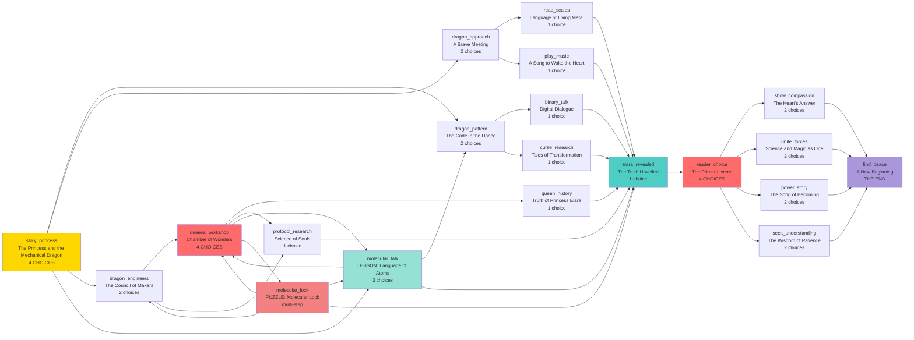

# Dragon Story Flow Map

This map visualizes the refactored structure of the dragon story arc after reducing choice overload.

## Refactored Structure

## Analysis of Refactored Structure

### Improvements

**Choice Reduction:**
- **Before**: 50+ nodes with mostly 4 choices each
- **After**: 18 nodes with 2-3 choices (only 3 nodes have 4 choices)

**Major Decision Points (4 choices):**
1. `story_princess` - Entry with 3 story paths + lesson
2. `queens_workshop` - 2 story paths + lesson + puzzle
3. `reader_choice` - 4 philosophical approaches (this was always perfect)

**Convergence Design:**
- All 3 investigation paths (pattern/approach/engineers) funnel into `elara_revealed`
- Creates a unified narrative moment before the philosophical choice
- Prevents exponential branching

**Educational Integration:**
- `molecular_talk` lesson accessible from entry point and workshop
- `molecular_lock` puzzle integrated into workshop discovery
- Both link back to story naturally

### Structure Breakdown

**Total Nodes: 18** (down from 50+)

**By Path:**
- Entry: 1 node (story_princess)
- Pattern path: 3 nodes
- Approach path: 3 nodes
- Engineers path: 4 nodes
- Convergence: 1 node (elara_revealed)
- Philosophical hub: 1 node (reader_choice)
- Resolution paths: 4 nodes
- Ending: 1 node (find_peace)

**By Choice Count:**
- 4 choices: 3 nodes (entry, workshop, philosophical choice)
- 3 choices: 1 node (lesson)
- 2 choices: 7 nodes (initial branches)
- 1 choice: 7 nodes (convergence flows)

**Educational Content:**
- Lessons: 1 (molecular communication)
- Puzzles: 1 (molecular lock with 3-chamber progression)

### Design Principles Applied

✅ **2-3 choices maximum** for most nodes
✅ **4 choices only at major decision points** (entry, workshop, philosophical)
✅ **Convergence points** where paths merge (elara_revealed)
✅ **Narrative flow nodes** (1-choice pages for pacing)
✅ **Lesson + puzzle integration** at natural story moments
✅ **Reduced exponential branching** (no stub references)

### Narrative Flow

1. **Investigation Phase** (3 paths)
   - Observation: Study patterns → decode binary/research curses
   - Interaction: Approach dragon → read scales/play music
   - Research: Consult engineers → visit workshop/study protocol

2. **Discovery Phase** (convergence)
   - All paths reveal Elara's identity and tragic story
   - Converge at elara_revealed node

3. **Choice Phase** (philosophical)
   - Reader decides approach: compassion/unity/story/understanding
   - Each resonates with different values

4. **Resolution Phase** (endings)
   - All paths lead to finding peace
   - Elara creates Academy of Transformations
   - Theme: Wisdom + compassion can change the world

## Future Expansion Ideas

- Add more puzzles to other investigation paths
- Create additional lesson content about transformation technology
- Expand ending variations based on chosen philosophy
- Add intermediate checkpoints with reflection moments
