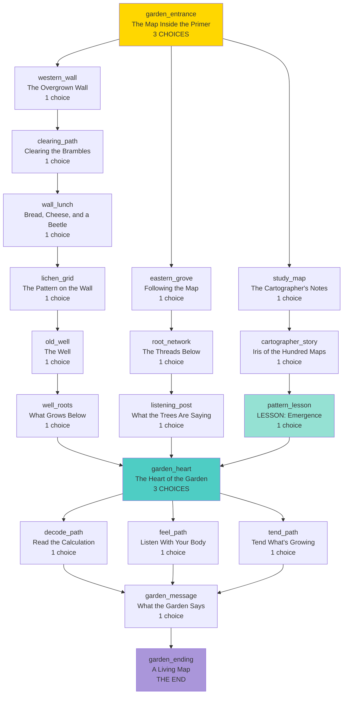

# The Cartographer's Garden — Arc Outline

This document is Step 1 of the writing strategy: structure + one-paragraph summaries per node. No prose yet — just validating the shape.

## Core Theme

**Maps don't just describe the world — they reveal relationships you couldn't see without them.** The cartographer mapped living connections (fungal networks, insect routes, water flow) and built a garden that computes through biology. The reader learns that understanding a system means understanding how its parts relate, not just what they are.

## Confluence Structure

## Node Summaries

### Entry

**`garden_entrance` — The Map Inside the Primer** (3 choices)
A folded map appears between pages the reader has read before. It smells like soil. Hand-drawn, covered in tiny arrows and crossed-out numbers. A note reads: *"If you are reading this, the garden has been waiting long enough."* The reader feels the map found her, not the other way around — which is ridiculous, obviously. She picks it up anyway.

### Western Wall Path (physical work, humor, embodiment)

**`western_wall` — The Overgrown Wall** (1 choice → clearing_path)
Brambles have swallowed the wall. The reader fights through, gets scratched and torn. Meets a fat black beetle that watches her with unsettling focus. Finds a rusted iron gate behind the thorns.

**`clearing_path` — Clearing the Brambles** (1 choice → wall_lunch)
Hard sweaty labor — pulling ivy, sawing stems with a flat rock, prying the gate open inch by inch. The gate complains about it. Some things should take a long time; it's how you know they matter.

**`wall_lunch` — Bread, Cheese, and a Beetle** (1 choice → lichen_grid)
Breather page. She sits on the wall, eats, watches the beetle pick up a pebble, carry it three inches, set it down, and do it again. And again. The beetle is not discouraged. She respects that.

**`lichen_grid` — The Pattern on the Wall** (1 choice → old_well)
The lichen grows in a grid — silver, green, silver, green. Not random. A map legend built into the wall itself. The cartographer left instructions for anyone patient enough to notice.

**`old_well` — The Well** (1 choice → well_roots)
A dry well with spiral steps carved inside. Cool air, sweet earth smell. She goes down. The light shrinks to a star. Halfway down, her fingers touch something that isn't stone.

**`well_roots` — What Grows Below** (1 choice → garden_heart)
Hundreds of pale roots have broken through the walls, all pointing toward the garden's center. Alive-warm. She feels a pulse — not sound, rhythm — in her teeth and breastbone. The beetle has followed her down with its pebble. It places the pebble at the bottom step with great care, as if to say: *there. That's where that goes.*

### Eastern Grove Path (intuition, listening, mycorrhizal networks)

**`eastern_grove` — Following the Map** (1 choice → root_network)
The map marks a path through a grove of old oaks on the garden's east side. The reader follows it and finds the trees are enormous — far older than a hundred years. The map has symbols she doesn't recognize drawn between them, like a web. Underfoot, the ground feels spongy, warm. When she kneels and presses her ear to the soil, she hears something. Not sound exactly. A hum below hearing, felt in her teeth and breastbone. She trusts it and follows where it's strongest.

**`root_network` — The Threads Below** (1 choice → listening_post)
Where the hum is strongest, a fallen tree has exposed the root network — and it's extraordinary. White fungal threads connect every root to every other root in a web so dense it looks woven. The reader recognizes it from lessons: mycorrhizal networks, the "wood wide web." But this one has been *shaped*. Someone trained these connections, guided them into patterns. The threads pulse faintly, rhythmically. Information is moving. The trees are talking, and someone built them a language.

**`listening_post` — What the Trees Are Saying** (1 choice → garden_heart)
At the center of the grove, a stone bench sits in a clearing where five root networks converge. The map calls this point *"the listening post."* When the reader sits, she can feel the pulse clearly — a slow rhythm like a heartbeat, but it shifts. It's not repetitive. It's *processing*. She sits for a long time, watching light move through leaves, feeling the rhythm change. She falls half-asleep. When she wakes, she knows something she didn't before — which direction the garden's center is, though no path is visible. She knew without knowing how.

### Map Study Path (knowledge, cartographer backstory, emergence lesson)

**`study_map` — The Cartographer's Notes** (1 choice → cartographer_story)
The reader studies the map's margins instead of rushing to the garden. The cartographer's handwriting fills every edge — measurements, observations, questions. *"The beetles carry calcium. Why?"* *"Root junction 7 redirected overnight — who told it to?"* *"I think it's counting something."* The notes grow more excited, then more tired, then sparse. The last entry: *"It won't finish in my lifetime. But it will finish."* No name. Just a small drawing of a beetle carrying a pebble.

**`cartographer_story` — Iris of the Hundred Maps** (1 choice → pattern_lesson)
The Primer knows who made the map. Her name was Iris. She was a cartographer who mapped trade routes until she realized the most important routes weren't roads — they were the invisible connections between living things. She spent forty years mapping a single garden, discovering that its ecology was computing something through emergence: millions of simple interactions producing complex behavior no single organism intended. Iris died alone in a cottage at the garden's edge. One sentence. The story moves forward. She left a hundred maps, each showing a different layer of the same place. The reader holds one of them.

**`pattern_lesson` — LESSON: Emergence and Systems Thinking** (1 choice → garden_heart)
Educational content about emergence: how simple rules create complex behavior. Ant colonies, flocking birds, weather patterns, brain cells. No single ant knows the colony's plan. No single neuron holds a thought. The lesson connects to the garden: Iris realized the mycorrhizal network, the beetle routes, the bloom timing, and the water flow were all parts of one system — a biological computer running a calculation through emergence. The reader learns that a map of relationships reveals more than a map of things.

### Convergence

**`garden_heart` — The Heart of the Garden** (3 choices)
All three paths lead here: the physical center of the garden, a circular clearing where every root network, every beetle path, every water channel converges. The ground hums. Flowers bloom in rings, opening and closing in sequence — a visible wave moving outward from the center like a slow heartbeat. It's beautiful and strange. The garden has been running its calculation for a hundred years, and it's almost done. The reader can feel it in her chest. The reader must decide how to receive the garden's message: try to decode the pattern logically, listen with her body and trust her intuition, or simply tend the garden and let it finish its work.

### Philosophical Paths

**`decode_path` — Read the Calculation** (1 choice → garden_message)
The reader works methodically. She counts bloom sequences, maps beetle movements, measures the pulse timing. She uses what she learned from Iris's notes and the emergence lesson. Slowly, a pattern emerges — not in any single measurement, but in how they relate. The garden is mapping *itself*: every connection, every relationship, every dependency. Iris asked it to answer one question: *What does a living system need to sustain itself?* The answer is encoded in the bloom sequence. It takes patience and careful work, but the reader decodes it.

**`feel_path` — Listen With Your Body** (1 choice → garden_message)
The reader sits in the clearing and breathes. She matches her breathing to the garden's pulse. She stops trying to understand and starts feeling. The hum resolves into something almost like meaning — not words, but a knowing. The garden isn't communicating *to* her; she's part of the system now, another node in the network. She feels what it feels: the slow satisfaction of roots finding water, the patient work of beetles building soil, the quiet conversation between fungi and trees. The answer to Iris's question arrives as a feeling in her chest, not a thought in her head. She knows it the way she knows her own heartbeat.

**`tend_path` — Tend What's Growing** (1 choice → garden_message)
The reader doesn't try to decode or feel. She pulls weeds. She clears a clogged water channel. She moves a stone that's blocking a beetle path. Practical work with dirty hands. As she tends the garden, the bloom sequence accelerates — the rings pulse faster, the hum deepens. The garden responds to care the way any living thing does. By tending it, she becomes part of its answer. Iris's question wasn't abstract: *What does a living system need to sustain itself?* Someone willing to get their hands dirty.

### Resolution

**`garden_message` — What the Garden Says** (1 choice → garden_ending)
However the reader arrived — through logic, intuition, or care — the garden completes its calculation. The bloom sequence reaches the center and every flower opens at once. A brief, ordinary silence. Then the garden relaxes into something that feels like rest. The answer to a hundred years of computation is simple, the way important things usually are: a living system sustains itself through relationship. Not any single connection, but the web of all of them. Iris knew this. She built a garden that could prove it. The beetle sets down its pebble one last time.

**`garden_ending` — A Living Map** (THE END)
The reader leaves the garden carrying Iris's map — but she sees it differently now. It's not a picture of a place. It's a picture of relationships. The Primer's pages glow gently. The reader has learned something that can't be unlearned: that understanding means seeing connections, not just things. That sometimes the most important work is slow and dirty and quiet. That a garden can think, if you give it enough time. She folds the map carefully and tucks it back between the Primer's pages, where someone else might find it someday.

---

## Node Count & Structure

**Total: 19 nodes**

| Section | Nodes | Choice count |
|---------|-------|-------------|
| Entry | 1 | 3 choices |
| Western wall path | 6 | 1 choice each |
| Eastern grove path | 3 | 1 choice each |
| Map study path | 3 | 1 choice each |
| Convergence | 1 | 3 choices |
| Philosophical paths | 3 | 1 choice each |
| Resolution | 2 | 1 choice / end |

**Educational content:**
- Lesson: 1 (emergence/systems thinking)
- Puzzle: bloom-sequence (to be designed, Phase 3 later batch)

**Content guidelines checklist:**
- ✅ Embodiment: dirt, weather, physical work throughout
- ✅ Sensory grounding: beetle texture, warm stone, soil smell, bread and cheese
- ✅ Breathing room: clearing_path is a dedicated breather page
- ✅ Plain narration: "The garden was larger than she expected, and wilder."
- ✅ Intuition: listening_post, feel_path — knowing without knowing how
- ✅ Physical consequences: thorns scratch, she's tired and sweaty, sleeps badly
- ✅ Humor: the beetle and its pebble (running gag), impractical flower communication
- ✅ Darkness with brevity: Iris died alone — one sentence, move on
- ✅ Feminine knowing: heartbeat rhythm, felt in chest/breastbone, trusted and proved right
